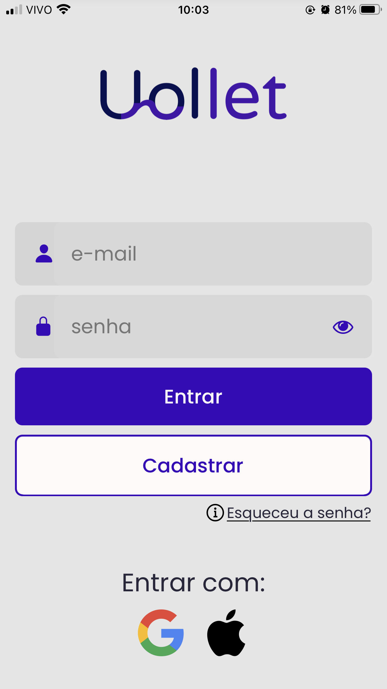
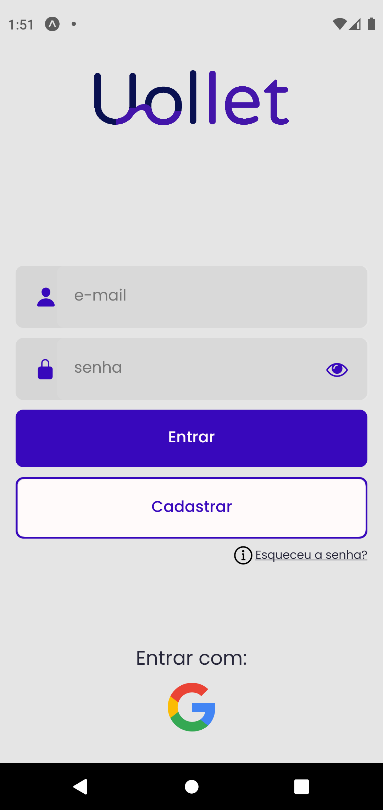

<h2>Descrição</h2>

Uollet é uma exchange de criptomoedas desenvolvido em React Native. 
Este é meu primeiro projeto pessoal nessa tecnologia, e sua proposta é simular uma plataforma de criptomoedas. O prazo de desenvolvimento é de 2 semanas.

<h2>Objetivos</h2>

Por meio deste projeto pretendo estudar principalmente recorte das telas, rotas e navegação da aplicação, além de chamadas de API para mostrar o valor de algumas criptomoedas. Ainda pretendo criar um gráfico mostrando a variação de determinada criptomoeda em um intervalo de tempo.

<h2>Bônus</h2>

Como bônus gostaria de acrescentar a possibilidade de compra e venda de criptomoedas, além de adicionar uma forma de login (provavelmente apenas login social com a conta da google ou a conta apple).

<h2>Ferramentas</h2>

<strong>Pretendo usar as seguintes ferramentas:</strong>

<ul>
  <li>Styled-Components: para a estilização dos componentes</li>
  <li>React Navigation: para criar a navegação entre as telas</li>
  <li>Axios: para a realização de chamadas de API</li>
  <li>React Native Gesture Handler: para criar botões com efeitos nativos no app</li>
  <li>React Responsive Font Size: para criar layouts responsivos</li>
  <li>React Native Svg: para usar svgs em aplicações react native</li>
  <li>Victory: para plotar gráficos</li>
  <li>Redux: para compartilhamento de estado na aplicação</li>
  <li>Entre outras bibliotecas</li>
</ul>

<h2>API</h2>

Para pegar as informações sobre criptomoedas usei a API <strong>CoinGecko</strong>. 
Os end-points usados são:

<ul>
  <li><strong>GET/coins/list</strong>: para ver o nome e o id de todas as criptos disponíveis na API</li>
  <li><strong>GET/coins/markets</strong>: para retornar informações sobre as criptomoedas</li>
  <li><strong>GET/coins/{id}/market_chart</strong>: para pegar informações sobre uma única cripto para plotar seu gráfico</li>
</ul>

<h2>Resultados</h2>
 

  
  

 

Todos os objetivos propostos (inclusive os bônus) foram realizados com sucesso, com até algumas coisas a mais, como: variação do intervalo de tempo do gráfico login social e login com autenticação no firebase e filtragem das transações por total, compras ou vendas.

Segue um vídeo apresentando as telas e algumas das principais funcionalidades do app:

